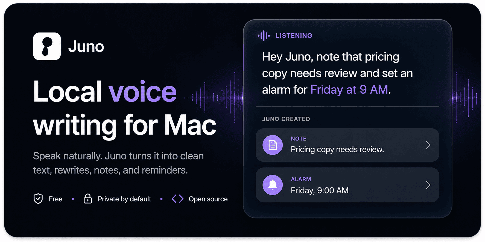
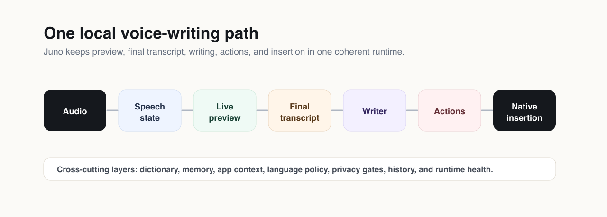

<p align="center">
  
</p>

Juno is a native Mac voice layer for people who want speech to become finished work, not just a raw transcript. Press a hotkey, talk naturally, watch the live transcript, and let Juno commit the final text into the app you were already using.

It is designed to be local, private, and free to run from source. The runtime handles live preview, final transcription, writing cleanup, transformations, actions, dictionary and memory, app context, privacy gates, and native insertion without requiring a hosted transcription account.

## What Juno Does

- Writes into the active Mac app from a hotkey.
- Shows live words while you are still speaking.
- Produces a cleaner final transcript when you stop.
- Turns rough speech into paragraphs, bullets, replies, notes, and structured writing.
- Rewrites selected or recent text with spoken commands.
- Creates notes, reminders, and alarms from natural language.
- Learns local vocabulary, names, snippets, replacements, and corrections.
- Uses app context so chat, email, notes, documents, code, and terminal surfaces are handled differently.
- Applies privacy gates for sensitive fields, capture, history, learning, and insertion.

## Voice Actions

Juno can route speech into actions instead of only inserting text.

```text
Hey Juno, note that the design review moved to Thursday.
Hey Juno, remind me tomorrow at 9 to send the agenda.
Hey Juno, set an alarm for 6:30.
```

One utterance can become clean writing plus follow-up work. Juno can split compound requests, resolve dates, and send the result to the local action sinks available on your Mac.

## Privacy Model

Juno is local-first by design.

- Microphone capture starts only when you trigger dictation or enable an explicit listening mode.
- Runtime data is stored locally on your machine.
- Dictionary and memory are local product features, not a cloud profile.
- Secure or sensitive surfaces can suppress context, learning, history, audio retention, and paste.
- The source runtime does not require an account or per-minute cloud billing.

## Requirements

- macOS 15 or newer for the native shell.
- Apple Silicon Mac for the full local model path.
- Python 3.10 or newer.
- Microphone permission for dictation.
- Accessibility permission for native insertion into other apps.

Linux can run selected runtime checks and portable Python paths, but the shipping desktop product is macOS-first.

## Run From Source

Bootstrap the Python environment:

```bash
./scripts/bootstrap.sh
source .venv/bin/activate
```

Check the environment:

```bash
./scripts/doctor.sh --ci
```

Install the default local model assets:

```bash
./scripts/bootstrap_full.sh
```

Start the standalone workbench:

```bash
./scripts/run_workbench.sh
```

Run the local Mac voice stack:

```bash
./scripts/run_live.sh
```

Install the macOS app locally:

```bash
./scripts/install_macos.sh --install-to-apps
```

Package the macOS app:

```bash
./scripts/package_macos.sh
```

## Architecture

<p align="center">
  
</p>

Juno follows one product path:

```text
audio -> speech state -> live preview -> final transcript -> writer -> actions -> native insertion
```

The Mac shell owns hotkeys, permissions, window state, secure-field policy, and insertion. The local runtime owns speech processing, preview, final transcription, writing, actions, dictionary and memory, app context, history, and health reporting.

## Development

Run the public smoke check before publishing changes:

```bash
./scripts/smoke_test.sh
```

Useful entry points:

- `scripts/bootstrap.sh` sets up the Python environment.
- `scripts/doctor.sh` checks required, optional, and platform-specific setup.
- `scripts/run_workbench.sh` starts the local workbench server.
- `scripts/run_live.sh` starts the local Mac voice stack.
- `scripts/install_macos.sh` installs the app locally.
- `scripts/package_macos.sh` packages the app.

Core folders:

- `juno_v2/` contains the voice runtime, workbench, memory, context, preview, final transcription, writer, and health tools.
- `juno_core_v3/` contains broker contracts, actions, policy, model registry, and compatibility layers.
- `shells/macos/` contains the native Mac shell.
- `seed_data/` contains local vocabulary and personalization seed data.
- `config/` contains example local configuration.

## License

MIT. See [LICENSE](LICENSE).
